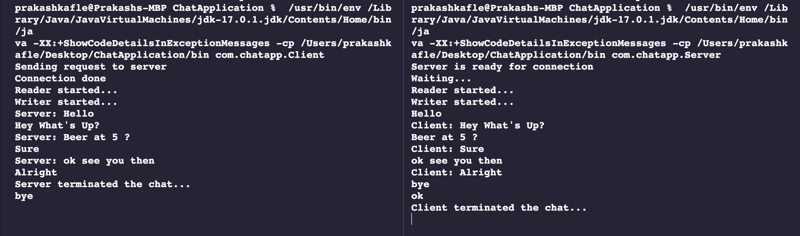

# Chat Application

This chat application is a simple program that allows users to communicate with each other in real-time using the Socket and ServerSocket classes in Java.

The users in the program are Client and Server.

Make sure you have the Java SE Development Kit (JDK) installed on your computer. If you don't have it installed, you can download it from the Java website.

This project was developed using [Java](https://www.java.com/) version 17.0.1

This project was developed using the Java Development Kit (JDK) version 17.0.1

How to run the program

# Note: 
Server and Client both class needs to run in separate terminal

Step 1
To run the program open project in any IDE and run Server.java inside src/com/chatapp directory

Step 2
On other terminal run Client.java which is inside same directory

This will start the threads for both classes. Start writing the message and hit enter, the messages will send from client to server and vice versa

If you write bye as a message, it will end the conversation

The following demo image is using Visual Studio Code.

You can download Visual Studio Code from [here](https://code.visualstudio.com/download).

